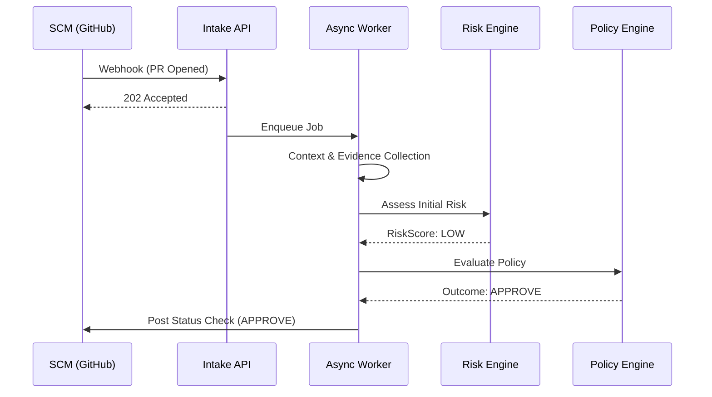
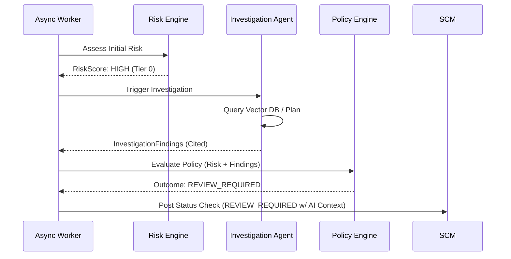
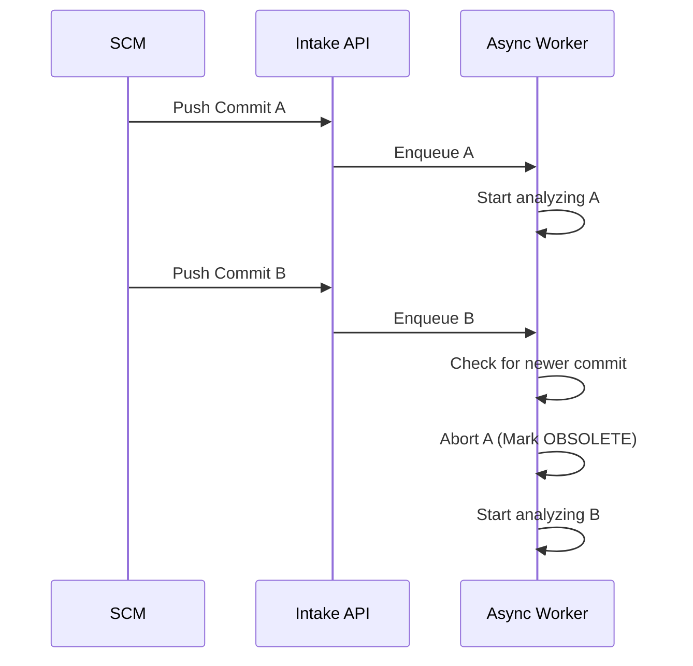

# End-to-End Analysis Workflow (V1 MVP)

This document defines the end-to-end workflow for analyzing a software change. It details how a change enters the system, how risk is assessed, when AI agents are triggered, and how a deterministic policy enforces the final decision.

## 1. Workflow Stages

The end-to-end flow is divided into cohesive stages. Most stages execute asynchronously via background workers to ensure the system remains responsive to SCM webhooks.

### 1.1 Change Intake
- **Trigger**: SCM Webhook (e.g., GitHub PR opened/synchronized).
- **Input**: Webhook payload (PR metadata, commit SHA).
- **Processing**: Authenticates payload, extracts basic metadata, deduplicates, and enqueues the analysis job.
- **Output**: `ChangeProposed` event.
- **Owner**: Organization Context / Change Context.
- **Failure**: HTTP 500 to SCM (if DB is down).
- **Retry**: Handled by SCM webhook delivery retry.
- **Execution**: Synchronous (fast API response).
- **Type**: Deterministic.
- **State Transition**: None -> `DETECTED`.

### 1.2 Change Normalization
- **Trigger**: `ChangeProposed` event from queue.
- **Input**: Change ID, Commit SHA.
- **Processing**: Fetches full diff, file list, and patch details from SCM via API. Generates `FileDiff` objects.
- **Output**: Structured Change with `CommitSnapshot`.
- **Owner**: Change Context.
- **Failure**: Marks analysis `FAILED` (e.g., SCM API rate limit).
- **Retry**: Exponential backoff.
- **Execution**: Asynchronous.
- **Type**: Deterministic.
- **State Transition**: `DETECTED` -> `ANALYZING`.

### 1.3 Context Collection
- **Trigger**: Internal workflow progression.
- **Input**: Normalized Change.
- **Processing**: Retrieves Service boundaries, dependencies, ownership, and `CriticalityTier` impacted by the `FileDiff`s. If context is missing, proceeds with "Unknown" flags (do not hallucinate context).
- **Output**: Aggregated System Context packet.
- **Owner**: System Context.
- **Execution**: Asynchronous.
- **Type**: Deterministic.

### 1.4 Evidence Collection
- **Trigger**: Internal workflow progression.
- **Input**: Normalized Change + System Context.
- **Processing**: Queries deterministic evidence (test history, previous PRs) and semantic evidence (similar incidents via pgvector). 
- **Output**: Set of `EvidenceRecord` citations.
- **Owner**: Evidence Context.
- **Execution**: Asynchronous.
- **Type**: Deterministic (SQL) & ML (Vector Search).

### 1.5 Initial Risk Assessment
- **Trigger**: Internal workflow progression.
- **Input**: Change, Context, Evidence.
- **Processing**: Evaluates deterministic signals (e.g., LOC, core files touched, fan-out, missing tests). Calculates initial `RiskScore` and outputs `RiskFactor`s.
- **Output**: Initial `RiskAssessment`.
- **Owner**: Risk Context.
- **Execution**: Asynchronous.
- **Type**: Deterministic.

### 1.6 Agent Investigation (Conditional)
- **Trigger**: Evaluated based on Agent Trigger Policy (see below).
- **Input**: Change, Context, Evidence, Initial RiskAssessment.
- **Processing**: LLM reasoning loop plans queries, evaluates findings, and synthesizes an explanation.
- **Output**: `AgentInvestigation` with `InvestigationFinding`s and `EvidenceCitation`s.
- **Owner**: Investigation Context.
- **Failure**: Fails gracefully (marks investigation as failed, workflow proceeds with deterministic risk).
- **Execution**: Asynchronous.
- **Type**: AI-Assisted.

### 1.7 Policy Evaluation
- **Trigger**: Completion of Initial Risk or Agent Investigation.
- **Input**: `RiskAssessment`, `AgentInvestigation` (if run), System Context, tenant `Policy`.
- **Processing**: Evaluates deterministic rules (e.g., `IF Risk=HIGH AND Tier=TIER_0 THEN REVIEW_REQUIRED`).
- **Output**: Policy matches and required actions.
- **Owner**: Policy Context.
- **Execution**: Asynchronous.
- **Type**: Deterministic.

### 1.8 Decision Generation & Result Publication
- **Trigger**: Policy Evaluation completion.
- **Input**: Policy matches, Risk factors, Agent findings.
- **Processing**: Compiles the `DecisionRecord`. Formats the explanation and posts the result back to the SCM (e.g., GitHub Checks API).
- **Output**: `DecisionRecord` (e.g., APPROVE, REVIEW_REQUIRED, BLOCK), SCM Check Run updated.
- **Owner**: Decision Context.
- **Execution**: Asynchronous.
- **State Transition**: `ANALYZING` -> `ANALYZED`; Decision -> `DRAFT` / `PENDING_ACTION`.

---

## 2. Synchronous vs Asynchronous Operations

**Synchronous**:
- **Webhook Intake**: Must respond with 2xx immediately to prevent SCM timeouts.
- **UI Data Retrieval**: Dashboards reading existing `DecisionRecord`s.

**Asynchronous**:
- **Everything else** (Normalization, Context/Evidence Collection, Risk Assessment, Agent Investigation, Policy Evaluation, Publication). 
- **Why**: SCM APIs, LLM calls, and Vector searches are slow and prone to timeouts or rate limits.
- **Tracking/Retries**: Handled via background job queues (e.g., PostgreSQL table acting as a queue) with idempotency keys. Failures are represented as `FAILED` job states, with terminal failures resulting in a "Fail-Safe" decision published to the SCM.

---

## 3. Idempotency and Versioning

### Idempotency Strategy
- **Idempotency Key**: `hash(TenantId, RepositoryId, PullRequestId, CommitSHA)`.
- **Duplicate Detection**: The queue rejects jobs with the same idempotency key if they are already `PENDING`, `RUNNING`, or `COMPLETED`.
- **Cancellation**: If a new commit is pushed to a PR while an old commit is still `ANALYZING`, the background worker detects the newer commit in the database, aborts the current processing, and marks the old analysis as `OBSOLETE`.

### Analysis Versioning
- An analysis is strictly bound to a `CommitSnapshot`.
- Identity: `ChangeId` (represents the PR) + `CommitSHA`.
- Every push creates a new `CommitSnapshot` iteration within the `Change`. Old decisions remain in the database for auditability ("What did we think of commit A before commit B was pushed?").

---

## 4. Evidence and Context Collection

### Context Collection
- **Minimum Required**: Repository name, changed file paths.
- **Optional**: Dependency graph, Service `CriticalityTier`, ownership mapping.
- **Missing Context**: The system explicitly flags missing context (e.g., "Criticality: UNKNOWN") and defaults to safe assumptions (e.g., treating unknown services as high risk).

### Evidence Collection
1. **Deterministic Evidence**: E.g., past PRs touching the same files.
2. **Semantic Evidence**: E.g., similar past incidents retrieved via `pgvector`.
3. **Agent-Discovered Evidence**: Evidence the agent finds by actively querying APIs during investigation.
- **Constraint**: ALL evidence is stored as an immutable `EvidenceRecord` with a traceable `EvidenceSource` URI.

---

## 5. Risk Assessment and Agent Trigger

### Initial Risk Assessment
- Completely deterministic. Evaluates file extensions, LOC, dependency fan-out, and basic configuration changes. Outputs a `RiskAssessment` (e.g., RiskScore: MEDIUM).

### Agent Trigger Conditions
The AI Agent is **NOT** invoked on every PR. It is invoked if:
1. `RiskScore` >= `HIGH`.
2. The change impacts a `TIER_0` service.
3. Deterministic evidence signals conflict (e.g., high test coverage but historically high incident rate for the file).
4. Explicit manual request.
- **Goal**: Reserve expensive/slow AI reasoning for high-impact or ambiguous scenarios.

### Agent Output
- The agent outputs `InvestigationFinding`s (text + `EvidenceCitation`).
- It does **NOT** modify the `RiskScore` directly and it does **NOT** enforce policy. It simply adds qualitative findings to the context.

---

## 6. Policy Evaluation and Decision Generation

### Policy Evaluation
- Deterministic rules executed against the `RiskAssessment` and `SystemContext`.
- **Missing Policy**: Defaults to `REVIEW_REQUIRED` for safety.
- **Conflicts**: The most restrictive rule always wins (e.g., BLOCK overrides REVIEW_REQUIRED).

### Decision Generation
- Possible outcomes: `APPROVE`, `REVIEW_REQUIRED`, `BLOCK`.
- Contains: `DecisionOutcome`, `DecisionReason`, `PolicyVersion` used, `RiskAssessmentId`.
- Completely reproducible from the inputs.

---

## 7. Failure Handling and Retries

### Failure Behavior (Fail-Safe Principle)
- **SCM Unavailable**: Retry with exponential backoff.
- **Vector Search / DB failure**: Terminal. Workflow halts.
- **LLM / Agent Unavailable**: Graceful degradation. The `AgentInvestigation` is marked `FAILED`, but the workflow continues to Policy Evaluation using only the Deterministic `RiskAssessment`. The final Decision notes that AI insights were unavailable.

### Timeouts and Retries
- **SCM APIs**: 3 retries, max backoff 5 minutes.
- **Agent/LLM**: 1 retry. Hard timeout at 2 minutes. Exhaustion results in graceful degradation.
- **Overall Pipeline**: 10-minute hard timeout. If exceeded, a "System Error - Manual Review Required" state is posted to the PR.

---

## 8. Observability

**Correlation Identifiers**:
- `TenantId` (Billing/Auth routing)
- `ChangeId` (PR level context)
- `CommitSHA` (Specific code version context)
- `AnalysisId` (Primary correlation ID bridging async queues, logs, and external API calls).

**Key Metrics**:
- Time to Decision (Latency).
- SCM Webhook processing time.
- LLM Token Cost per Analysis.
- AI Graceful Degradation Rate (how often the agent times out).

---

## 9. Workflow Diagrams

### 9.1 Happy-Path (Deterministic, Low-Risk)

### 9.2 High-Risk Investigation Path

### 9.3 Async Cancellation (New Commit Pushed)

---

## 10. Architecture Consistency Check
- **Risk vs Decision separated**: Yes. Policy Evaluation runs sequentially *after* Risk and Agent.
- **Evidence Traceable**: Yes. Agent must output citations linked to standard `EvidenceRecord`s.
- **Fail Safe**: Yes. AI failures result in fallback to deterministic risk rules.
- **No Conflict**: The workflow perfectly aligns with the AR boundaries defined in `domain-model.md`.

## 11. Open Questions
- What specific background job framework will be used in the Spring Boot monolith (e.g., Quartz, JobRunr, Spring Batch)?
- How granular should the idempotency keys be stored (e.g., Redis vs a dedicated PostgreSQL `analysis_jobs` table)?
