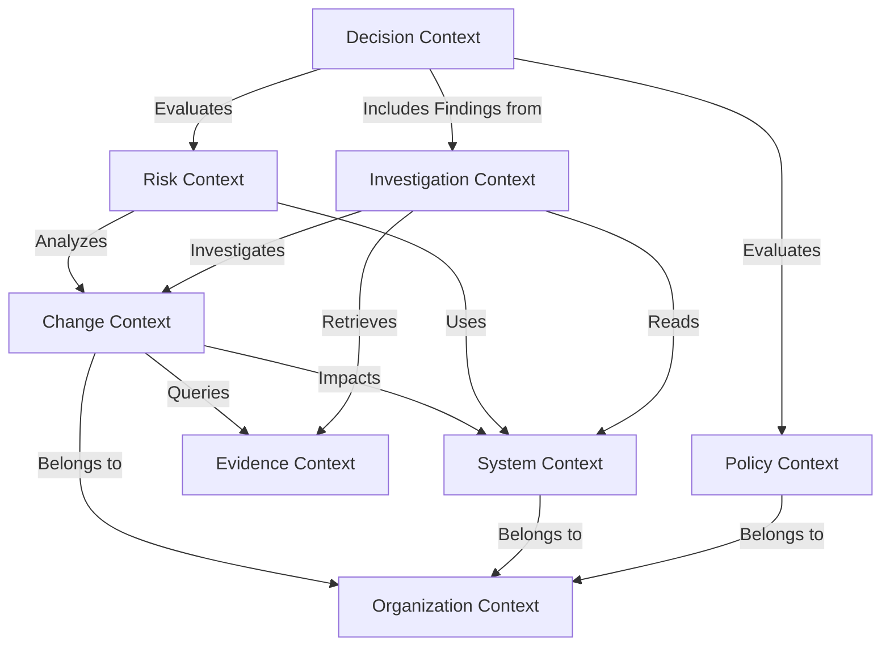

# Bounded Contexts (V1 MVP)

This document defines the domain boundaries for the MVP of the Engineering Change Decision Intelligence platform. Our architecture follows a modular monolith approach, prioritizing cohesive boundaries that enforce separation of concerns, particularly between Risk, Policy, Decision, and Investigation.

## Context Map

---

## 1. Organization Context
**Purpose**: Manages multi-tenancy, identity, and third-party integrations (e.g., GitHub).
**Responsibilities**:
- Tenant isolation.
- User management and roles.
- Managing source control installation tokens/secrets.
**Explicit non-responsibilities**: Defining policies or assessing risk.
**Owned concepts**: Tenant, User, Integration Configuration.
**Important invariants**: All actions in the system must resolve to a valid, active Tenant.
**Dependencies**: None.
**Inputs**: OAuth callbacks, user provisioning.
**Outputs**: Auth tokens, Tenant context.
**Domain events published**: `TenantCreated`, `IntegrationAdded`.
**Monolith inclusion**: Yes, remains in monolith.
**Future extraction**: Unlikely to become an independent service until massive scale requires a dedicated IAM service.

---

## 2. Change Context
**Purpose**: Represents the proposed software modification and its deterministic structural properties.
**Responsibilities**:
- Ingesting Pull Requests (GitHub).
- Parsing diffs and metadata.
- Deterministic analysis (LOC changed, files touched, AST parsing).
**Explicit non-responsibilities**: Deciding if the change is safe; assessing business risk.
**Owned concepts**: Pull Request, Commit, Diff, File Modification, Repository.
**Important invariants**: A Change must be immutable once merged or closed. Analysis is bound to a specific commit hash.
**Dependencies**: Organization (for integration config).
**Inputs**: Webhooks (PR opened/updated), API sync requests.
**Outputs**: Structured Change representations.
**Domain events published**: `ChangeProposed`, `ChangeUpdated`, `ChangeMerged`.
**Monolith inclusion**: Yes.
**Future extraction**: High candidate for extraction if webhook ingestion volume or heavy AST parsing becomes a bottleneck.

---

## 3. System Context
**Purpose**: Maintains the architectural model and criticality of the software being changed.
**Responsibilities**:
- Tracking service boundaries and ownership.
- Maintaining dependency graphs.
- Assigning criticality tiers (e.g., Tier-0 payment service).
**Explicit non-responsibilities**: Tracking runtime deployment state or incidents.
**Owned concepts**: Service, Dependency, Criticality Tier, Owner.
**Important invariants**: Every Service must have an assigned Criticality Tier.
**Dependencies**: Organization.
**Inputs**: Architecture definition files (e.g., `catalog-info.yaml`), manual configuration.
**Outputs**: Dependency graphs, service metadata.
**Domain events published**: `ServiceCriticalityUpdated`, `DependencyChanged`.
**Monolith inclusion**: Yes.
**Future extraction**: May eventually integrate with or become an Internal Developer Portal (IDP) adapter.

---

## 4. Evidence Context
**Purpose**: The system's memory. Stores and retrieves historical data for grounding risk and investigations.
**Responsibilities**:
- Storing historical PRs, incidents, postmortems.
- Managing vector embeddings (pgvector) for semantic retrieval.
- Retrieving similar past changes.
**Explicit non-responsibilities**: Drawing conclusions from the evidence.
**Owned concepts**: Incident Record, Historical Change, Evidence Document, Embedding.
**Important invariants**: Evidence is read-only historical truth; it cannot be retroactively altered to change past decisions.
**Dependencies**: Organization.
**Inputs**: Historical data imports, incident webhooks.
**Outputs**: Semantic search results, contextual evidence packets.
**Domain events published**: `EvidenceIngested`.
**Monolith inclusion**: Yes.
**Future extraction**: Medium candidate; RAG/embedding pipelines often scale differently than transactional workloads.

---

## 5. Risk Context
**Purpose**: Quantifies the danger of a proposed change based on deterministic signals and historical probability.
**Responsibilities**:
- Calculating deterministic risk signals (e.g., "touches 5 core services").
- Applying lightweight ML risk models.
- Answering solely: "How risky is this?"
**Explicit non-responsibilities**: Deciding what to do about the risk. Enforcing policy.
**Owned concepts**: Risk Signal, Risk Score, Risk Profile.
**Important invariants**: Risk assessment must be reproducible for a given Change at a given point in time.
**Dependencies**: Change, System Context.
**Inputs**: `ChangeProposed` events.
**Outputs**: Risk Assessment report.
**Domain events published**: `RiskAssessed`.
**Monolith inclusion**: Yes.
**Future extraction**: High candidate. Model inference and feature calculation will eventually require specialized compute (Python/GPUs).

---

## 6. Investigation Context
**Purpose**: Manages AI agent reasoning and exploration to investigate uncertainty.
**Responsibilities**:
- Planning investigation steps for a Change.
- Querying Evidence and System Context.
- Synthesizing findings into structured, schema-validated formats.
- Providing explainability (WHY it is risky).
**Explicit non-responsibilities**: Taking autonomous action (no merging/deploying). Enforcing deterministic rules.
**Owned concepts**: Investigation Plan, Agent Prompt, Synthesized Finding.
**Important invariants**: Agent outputs must trace back to cited Evidence (no hallucinated grounding).
**Dependencies**: Change, System Context, Evidence.
**Inputs**: `ChangeProposed` events, manual triggers.
**Outputs**: Structured Investigation Findings.
**Domain events published**: `InvestigationCompleted`.
**Monolith inclusion**: Yes (orchestration lives in monolith).
**Future extraction**: Likely. LLM orchestration, long-running agent loops, and prompt management often migrate to dedicated services.

---

## 7. Policy Context
**Purpose**: Defines the organization's deterministic safety rules and governance.
**Responsibilities**:
- Managing rules (e.g., "Tier-0 changes with HIGH risk require Staff Engineer approval").
- Providing the deterministic evaluation engine logic.
**Explicit non-responsibilities**: Executing the decision lifecycle or applying the human overrides.
**Owned concepts**: Policy, Rule, Condition.
**Important invariants**: Policies must be deterministic and versioned.
**Dependencies**: Organization.
**Inputs**: User configuration (UI/API).
**Outputs**: Policy rule sets.
**Domain events published**: `PolicyUpdated`.
**Monolith inclusion**: Yes.
**Future extraction**: Low candidate.

---

## 8. Decision Context
**Purpose**: Combines Risk, Investigation findings, and Policy to determine the required action and manage human sign-off.
**Responsibilities**:
- Evaluating Risk output against Policy.
- Generating the final Decision (e.g., APPROVE, BLOCK, REVIEW_REQUIRED).
- Explaining the Decision (combining Agent findings + Policy matches).
- Recording human confirmations/overrides.
**Explicit non-responsibilities**: Calculating the risk score or running the AI agent.
**Owned concepts**: Decision Record, Recommendation, Override, Approval.
**Important invariants**: A Decision must point to the exact version of the Policy, Risk Profile, and Investigation Findings used to make it (auditability). Human override always wins.
**Dependencies**: Risk, Investigation, Policy.
**Inputs**: `RiskAssessed`, `InvestigationCompleted`, `PolicyUpdated` events, Human actions.
**Outputs**: Final Decision payload, SCM status checks (e.g., GitHub Checks).
**Domain events published**: `DecisionRendered`, `DecisionOverridden`.
**Monolith inclusion**: Yes.
**Future extraction**: Low candidate for extraction; this is the core transactional orchestration heart of the system.

---

## Future Contexts (Out of Scope for V1)
- **Deployment**: Tracking the actual rollout of the change.
- **Outcome**: Measuring system health post-deployment (metrics, alerts).
- **Attribution**: Automatically linking outcomes back to decisions.
- **Learning/Calibration**: Adjusting Risk models based on Attribution.

## Architectural Rationale
- **Separation of Risk and Decision**: This is critical. Risk is an objective observation (Probability of failure is X). Decision is a subjective business choice based on policy (Because probability is X and service is Tier-0, we require 2 approvals). Conflating these leads to rigid, uncalibratable systems.
- **Agent Isolation**: The Investigation context is completely decoupled from Decision enforcement. The agent acts as an advanced researcher providing *inputs* to the deterministic Decision context, preserving safety.
- **Evidence Ownership**: Evidence is separated from System Context to distinguish between immutable historical truth (Evidence) and current architectural reality (System Context).

## Open Questions
- How do we handle cross-repository dependencies in the Change and System Contexts during V1?
- What specific technology (e.g., CEL, SpEL, custom DSL) will power the Policy evaluation engine?
