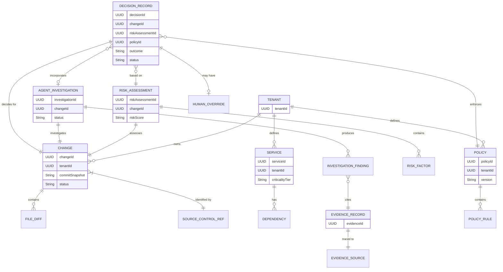

# Domain Model (V1 MVP)

This document defines the domain model for the V1 Engineering Change Decision Intelligence platform, aligning strictly with the bounded contexts defined in `bounded-contexts.md`.

## 1. Domain Modeling Principles
- **Explicit Concepts**: Domain rules are modeled explicitly, not buried in generic metadata blobs.
- **Clear Aggregate Boundaries**: Aggregates protect invariants. We strictly avoid "God aggregates" (e.g., a `Change` does not contain its `Decision` or `RiskAssessment`; it references them).
- **Separation of Concerns**: Risk (objective probability) is strictly separated from Decision (subjective policy enforcement).
- **Immutability**: Historical records (Evidence) and completed assessments (Risk, Decision) are immutable.
- **Traceability**: All decisions must trace back to the specific Policy version, Risk assessment, and Evidence used.

---

## 2. Aggregate Roots (AR)

Each Bounded Context generally maps to one or more primary Aggregate Roots.

### A. Organization Context
- **`Tenant` (AR)**
  - **Purpose**: Represents an organization or billing entity.
  - **Identity**: `TenantId`
  - **Entities/VOs**: `IntegrationConfig` (VO)

### B. Change Context
- **`Change` (AR)**
  - **Purpose**: Represents the proposed software modification at a specific point in time.
  - **Identity**: `ChangeId`
  - **Entities/VOs**: 
    - `SourceControlReference` (VO): PR number, Repo URI.
    - `CommitSnapshot` (VO): The specific commit hash being analyzed.
    - `FileDiff` (VO): Path, additions, deletions, change type.
  - **Invariants**: Analysis is locked to a specific `CommitSnapshot`. If a new commit is pushed, a new `Change` (or a new version/snapshot within the Change) must be evaluated.

### C. System Context
- **`Service` (AR)**
  - **Purpose**: Represents a deployable software unit.
  - **Identity**: `ServiceId`
  - **Entities/VOs**: 
    - `CriticalityTier` (VO): e.g., TIER_0, TIER_1.
    - `Dependency` (VO): References to other `ServiceId`s.
  - **Invariants**: Every Service must have a defined `CriticalityTier`.

### D. Evidence Context
- **`EvidenceRecord` (AR)**
  - **Purpose**: Immutable historical truth used to ground AI and Risk.
  - **Identity**: `EvidenceId`
  - **Entities/VOs**:
    - `EvidenceSource` (VO): The origin of this evidence. Contains a type (`INCIDENT`, `PAST_CHANGE`, `DOCUMENTATION`) and a unique reference URI.
  - **Invariants**: Must be append-only and immutable. Must have a traceable `EvidenceSource`.

### E. Risk Context
- **`RiskAssessment` (AR)**
  - **Purpose**: Objective measurement of how risky a change is.
  - **Identity**: `RiskAssessmentId`
  - **Entities/VOs**:
    - `RiskScore` (VO): The calculated risk level (e.g., HIGH, MEDIUM, LOW) or probability.
    - `RiskFactor` (VO): Specific deterministic or ML signals (e.g., "Touches 5 files in core payment module").
  - **Invariants**: Must reference exactly one `ChangeId` and `CommitSnapshot`. **Must NOT** contain policy rules or required actions.

### F. Investigation Context
- **`AgentInvestigation` (AR)**
  - **Purpose**: Represents the AI's research into the change.
  - **Identity**: `InvestigationId`
  - **Entities/VOs**:
    - `InvestigationFinding` (VO): Structured explanation of a specific risk or context.
    - `EvidenceCitation` (VO): References to `EvidenceId`s supporting the finding.
  - **Invariants**: Must reference a `ChangeId`. All findings must be backed by an `EvidenceCitation` to prevent hallucination.

### G. Policy Context
- **`Policy` (AR)**
  - **Purpose**: The deterministic rules dictating required actions for a tenant.
  - **Identity**: `PolicyId`
  - **Entities**: 
    - `PolicyRule` (Entity): e.g., "IF Risk=HIGH AND Tier=TIER_0 THEN REQUIRE_REVIEW".
  - **Invariants**: Rules must be deterministic. Policies are versioned; modifying a policy creates a new version to preserve auditability of past decisions.

### H. Decision Context
- **`DecisionRecord` (AR)**
  - **Purpose**: The final, explainable verdict of what must happen before the change is merged.
  - **Identity**: `DecisionId`
  - **Entities/VOs**:
    - `DecisionOutcome` (VO/Enum): `APPROVE`, `REVIEW_REQUIRED`, `BLOCK`.
    - `DecisionReason` (VO): The explanation linking the policy rule to the risk factors/findings.
    - `HumanOverride` (VO): Records if a human overrode the system's decision, with actor identity and justification.
  - **Invariants**: Must reference `ChangeId`, `RiskAssessmentId`, `InvestigationId` (optional), and the exact `PolicyId` (with version) used to render the decision.

---

## 3. Important Relationships

- **Change** `BelongsTo` **Tenant**
- **Service** `BelongsTo` **Tenant**
- **RiskAssessment** `Analyzes` **Change**
- **RiskAssessment** `Reads` **Service** (for criticality)
- **AgentInvestigation** `Investigates` **Change**
- **AgentInvestigation** `Cites` **EvidenceRecord**
- **DecisionRecord** `Evaluates` **RiskAssessment**
- **DecisionRecord** `Enforces` **Policy**
- **DecisionRecord** `Summarizes` **AgentInvestigation**

*Note: These relationships cross Bounded Context boundaries and are typically modeled by storing the Identity (ID) of the target Aggregate Root, not by holding object references.*

---

## 4. Lifecycles and State Transitions

### A. Change Lifecycle
- **States**: `DETECTED` -> `ANALYZING` -> `ANALYZED` -> `OBSOLETE` (if new commit pushed)
- **Transitions**: 
  - Webhook triggers `DETECTED`.
  - Background worker transitions to `ANALYZING`, then `ANALYZED` once structural parsing is done.

### B. RiskAssessment Lifecycle
- **States**: `PENDING` -> `CALCULATING` -> `COMPLETED` -> `FAILED`
- **Transitions**: Triggered automatically when Change reaches `ANALYZED`.

### C. AgentInvestigation Lifecycle
- **States**: `REQUESTED` -> `RUNNING` -> `SYNTHESIZING` -> `COMPLETED` | `FAILED`
- **Transitions**: AI Agent transitions state as it plans, queries evidence, and formats findings.

### D. DecisionRecord Lifecycle
- **States**: `DRAFT` -> `PENDING_ACTION` (e.g., waiting for human review) -> `RESOLVED` | `OVERRIDDEN`
- **Transitions**: 
  - Generated as `DRAFT` when Risk and Policy are evaluated.
  - If `REVIEW_REQUIRED`, waits in `PENDING_ACTION`.
  - Human approval moves to `RESOLVED`.
  - Admin bypass moves to `OVERRIDDEN`.

---

## 5. Domain Invariants Summary

1. **Separation of Concerns**: A `RiskAssessment` only states risk probability/factors. It cannot state "Block this PR".
2. **Auditability**: A `DecisionRecord` is an immutable snapshot tying together the specific PR commit, the risk score, the agent findings, and the exact policy version.
3. **Traceability**: `EvidenceRecord` must have a verifiable `EvidenceSource`. The Agent cannot invent evidence.
4. **Human Control**: A `DecisionRecord` can be transitioned to `OVERRIDDEN`, but it requires an explicit `HumanOverride` value object containing the actor and justification.
5. **No Giant Aggregates**: A `Tenant` does not hold a list of millions of `Change` objects. `Change` objects hold a `TenantId`.

---

## 6. Domain Model Diagram

---

## 7. Future Domain Concepts (Out of Scope for V1)
- **Deployment**: The execution of a `Change` in a target environment.
- **Outcome**: Post-deployment metrics (e.g., latency spikes, rollbacks).
- **Attribution**: The ML model correlating an `Outcome` back to the original `RiskAssessment` to tune future `RiskScore` generation.

## 8. Open Questions
- Should `Change` handle multiple sequential commits as distinct `Change` aggregates, or update a single `Change` with new `CommitSnapshot` versions? (Recommendation: A new commit invalidates the old Decision, effectively starting a new evaluation cycle, but from a UX perspective it belongs to the same PR).
- How is the `EvidenceSource` URI standardized across disparate systems (e.g., Jira vs GitHub Issues vs PagerDuty)?
