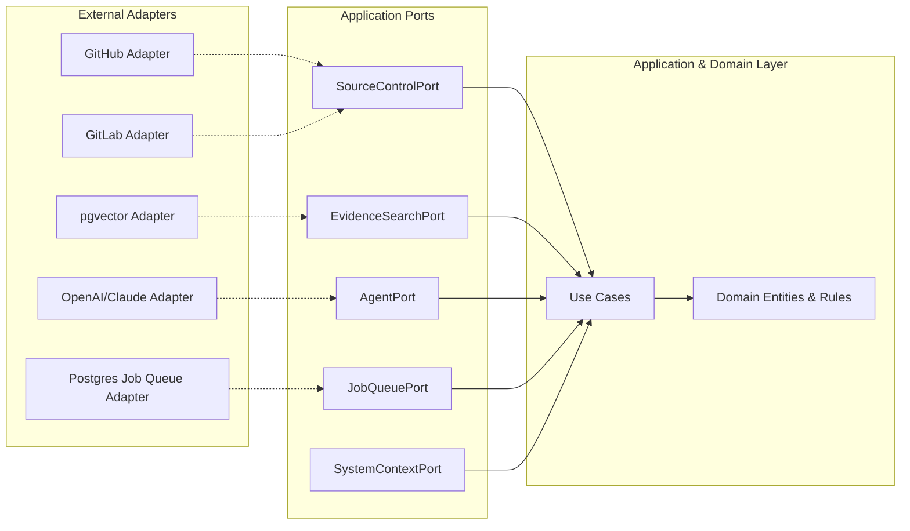

# Ports and Adapters (Hexagonal Architecture)

This document defines the external boundaries (ports) of the application. The domain and application layers remain completely ignorant of the technologies implementing these ports (e.g., GitHub, PostgreSQL, OpenAI, Spring Batch). 

## 1. Architecture Overview

## 2. Defined Ports

### 2.1 SourceControlPort
**Purpose**: Abstracts interactions with version control systems (GitHub, GitLab, Bitbucket).
**Methods Conceptualized**:
- `getChangeMetadata(TenantId, RepoId, PRId)` -> Returns abstract PR info.
- `getDiff(TenantId, RepoId, CommitSHA)` -> Returns abstract `FileDiff` list.
- `publishStatusCheck(TenantId, RepoId, CommitSHA, DecisionOutcome, Details)` -> Posts a commit status/check run.
**Constraints**: The application must not import any GitHub SDK classes. The port must translate provider-specific webhooks and API responses into our standard domain representation.

### 2.2 SystemContextPort
**Purpose**: Retrieves architecture metadata and ownership information.
**Methods Conceptualized**:
- `getServiceCriticality(TenantId, RepoId, FilePaths)` -> Returns `CriticalityTier`.
- `getDependencies(TenantId, ServiceId)` -> Returns dependency graph.
**Constraints**: Abstracted from whether this data lives in a local YAML catalog, an internal Postgres DB, or an external IDP (e.g., Backstage).

### 2.3 EvidenceSearchPort
**Purpose**: Retrieves historical truth (incidents, past changes, documentation) relevant to the current change.
**Methods Conceptualized**:
- `searchSimilarChanges(TenantId, FileDiffs, Limit)` -> Returns `EvidenceRecord`s.
- `searchIncidents(TenantId, ServiceId, Keywords, Limit)` -> Returns `EvidenceRecord`s.
**Constraints**: The application does not know if the implementation uses SQL `ILIKE`, `pgvector` semantic search, or an external ElasticSearch cluster.

### 2.4 AgentPort
**Purpose**: Boundary to the AI Risk Investigation Agent.
**Methods Conceptualized**:
- `investigate(AgentContext, RiskAssessment, Evidence)` -> Returns `InvestigationFindings`.
**Constraints**: 
- Must return strongly typed, structured outputs (findings, citations).
- Must not expose LangChain, OpenAI, Claude, or Gemini specific types.
- The application layer is responsible for structurally validating the output (e.g., ensuring evidence citations actually exist) before accepting the result.

### 2.5 JobQueuePort
**Purpose**: Enqueues asynchronous application commands.
**Methods Conceptualized**:
- `enqueue(CommandName, Payload, IdempotencyKey)` -> Returns JobId.
- `cancel(IdempotencyKey)` -> Marks a pending/running job as OBSOLETE.
**Constraints**: Hides the implementation details of the background worker framework (e.g., Spring Batch, JobRunr, or custom Postgres queues). Does not imply the existence of a heavyweight broker like Kafka.

---

## 3. Rejected Ports

- **RiskAssessmentPort**: Rejected for V1. The initial risk assessment is deterministic and relies on internal domain rules (e.g., LOC > 500 = HIGH risk). We do not need an external port until we introduce external ML model inference.
- **PolicyPort**: Rejected for V1. Policy evaluation is a deterministic domain service running inside the monolith. Creating a port for it now is premature abstraction.

---

## 4. Port Failure Contracts

The application layer handles adapter failures according to the Fail-Safe Principle defined in the workflow:

| Port | Failure Type | Retry Policy | Fallback / Consequence |
|---|---|---|---|
| `SourceControlPort` | API Rate Limit / 5xx | Exponential backoff (max 3) | Fails analysis. Manual review required. |
| `SystemContextPort` | Catalog unavailable | Short backoff (max 3) | Graceful degradation: Service marked `UNKNOWN` criticality (treated as high-risk). |
| `EvidenceSearchPort` | Vector DB timeout | No retry | Graceful degradation: Zero evidence returned. Risk relies on deterministic signals only. |
| `AgentPort` | LLM Timeout / Bad schema | 1 immediate retry | Graceful degradation: `AgentInvestigation` marked FAILED. Policy proceeds using only the initial RiskAssessment. |
| `JobQueuePort` | DB Unavailable | Bubble up to webhook | 500 response to SCM. SCM will retry webhook delivery. |
