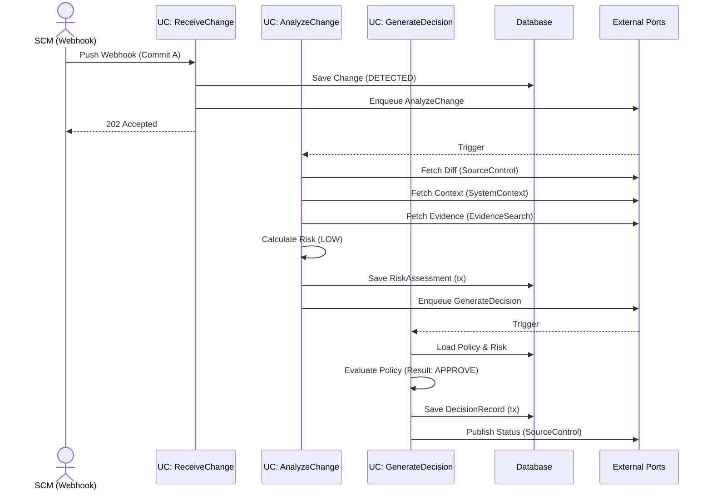
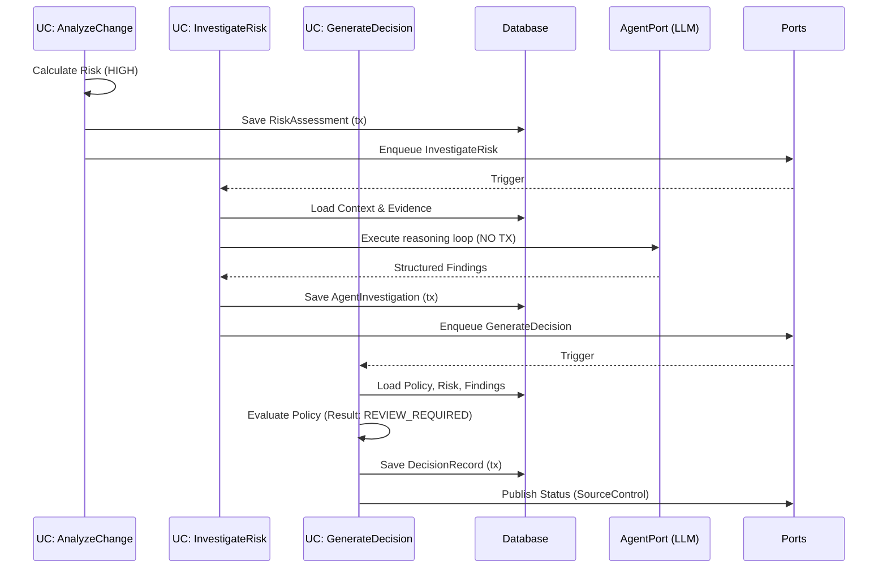

# Application Use Cases (V1 MVP)

This document defines the application layer for the V1 Engineering Change Decision Intelligence platform. The application layer coordinates domain logic and external ports but does not contain infrastructure, database, or LLM-specific implementations.

## 1. Application Layer Principles
- **Orchestration Only**: Application services orchestrate domain objects and external ports. Domain rules remain in the domain models.
- **Transaction Scope**: Long-running operations (API calls, LLM generation, vector search) **MUST NEVER** happen inside an open database transaction.
- **Command/Query Separation**: Operations that mutate state (Commands) are structurally separated from operations that return data (Queries) to simplify idempotency and scaling.

---

## 2. Authorization Model

Authentication is handled upstream. The application expects a resolved user/tenant identity.

**V1 Roles**:
- **System Worker**: Background processor. Permitted to execute analysis jobs and update state.
- **Tenant Admin**: Permitted to manage policies, configure integrations, and override decisions.
- **Engineer**: Permitted to view analyses, manually trigger re-analysis, and view evidence.

---

## 3. Application Error Contract

Application services return standard error categories (to be translated by the API layer into HTTP responses):

- `CHANGE_NOT_FOUND`: The requested PR/Commit does not exist in the tenant.
- `ANALYSIS_ALREADY_RUNNING`: The idempotency key matched an active job.
- `ANALYSIS_SUPERSEDED`: A newer commit invalidated this analysis.
- `INSUFFICIENT_CONTEXT`: Required architecture metadata is missing.
- `EVIDENCE_COLLECTION_FAILED`: Upstream RAG/search failed.
- `AGENT_INVESTIGATION_FAILED`: LLM timeout or structural validation failed.
- `POLICY_EVALUATION_FAILED`: Policy syntax error or missing variables.
- `UNAUTHORIZED`: Actor lacks required role.

---

## 4. Port Dependencies

The application layer relies on the following abstract ports (adapters implement these):

- `SourceControlPort`: Fetches PR diffs, commits, and posts status checks (e.g., GitHub API).
- `SystemContextPort`: Retrieves service boundaries, dependencies, and criticality.
- `EvidenceSearchPort`: Retrieves deterministic history (SQL) and semantic incidents (pgvector).
- `AgentPort`: Executes the LLM reasoning loop and returns structured findings.
- `JobQueuePort`: Enqueues asynchronous commands.

---

## 5. Use Case Map: Commands

### 5.1 Receive Change
- **Purpose**: Intake a software change from an SCM webhook.
- **Actor**: System (via Webhook) or Engineer (manual trigger).
- **Preconditions**: Valid tenant integration.
- **Input**: SCM identifiers (Repo, PR ID, Commit SHA, Branch).
- **Processing**:
  - Validates payload.
  - Determines if this commit supersedes a previous pending analysis (marks old as `OBSOLETE`).
  - Persists initial `Change` entity.
  - Enqueues `AnalyzeChange` command.
- **Output**: Job tracking ID.
- **Ports**: `JobQueuePort`.
- **Transaction**: Short, strict DB transaction to insert/update `Change` status.
- **Idempotency**: Keyed by `hash(TenantId, RepoId, PRId, CommitSHA)`. Duplicate requests return the existing Job ID.
- **Behavior**: Synchronous execution (fast response).

### 5.2 Analyze Change
- **Purpose**: The primary background orchestrator for the analysis workflow.
- **Actor**: System Worker.
- **Trigger**: Job queue.
- **Input**: `ChangeId`, `CommitSHA`.
- **Processing**:
  - 1. **Normalize**: Call `SourceControlPort` to get full diff. Update `Change`.
  - 2. **Context**: Call `SystemContextPort`.
  - 3. **Evidence**: Call `EvidenceSearchPort` to retrieve context.
  - 4. **Risk**: Calculate deterministic `RiskAssessment` using domain rules. Save Risk.
  - 5. **Conditional Agent**: If Risk is HIGH or Policy dictates, enqueue `InvestigateRisk`. Otherwise, enqueue `GenerateDecision`.
- **Ports**: `SourceControlPort`, `SystemContextPort`, `EvidenceSearchPort`, `JobQueuePort`.
- **Transaction**: **No global transaction.** Each sub-step (saving context, saving risk) opens and closes its own small transaction. External port calls happen *outside* transactions.
- **Idempotency**: Job queue level exactly-once/at-least-once with DB state checks.
- **Behavior**: Asynchronous.

### 5.3 Investigate Risk
- **Purpose**: Executes the AI agent reasoning loop.
- **Actor**: System Worker (triggered by `AnalyzeChange`) or Engineer (manual trigger).
- **Input**: `ChangeId`, `RiskAssessmentId`.
- **Processing**:
  - Fetches context and evidence.
  - Calls `AgentPort` with prompt context.
  - Validates returned structured findings.
  - Persists `AgentInvestigation` and `EvidenceCitation`s.
  - Enqueues `GenerateDecision`.
- **Ports**: `AgentPort`, `JobQueuePort`.
- **Transaction**: Small DB transaction at the end to persist findings. `AgentPort` execution is strictly outside the transaction.
- **Failure**: On `AGENT_INVESTIGATION_FAILED`, enqueues `GenerateDecision` with a flag indicating degraded mode.
- **Behavior**: Asynchronous.

### 5.4 Generate Decision
- **Purpose**: Evaluates deterministic policy against risk and findings to produce the final outcome.
- **Actor**: System Worker.
- **Input**: `ChangeId`, `RiskAssessmentId`, `InvestigationId` (optional).
- **Processing**:
  - Loads tenant `Policy`.
  - Evaluates rules against `RiskScore` and `SystemContext`.
  - Generates `DecisionRecord` (APPROVE, REVIEW_REQUIRED, BLOCK).
  - Calls `SourceControlPort` to publish the status check.
- **Ports**: `SourceControlPort`.
- **Transaction**: Small DB transaction to save `DecisionRecord`.
- **Behavior**: Asynchronous.

---

## 6. Use Case Map: Queries

### 6.1 Retrieve Change Analysis
- **Purpose**: Provides the UI/CLI with the current state of a change.
- **Actor**: Engineer.
- **Input**: `TenantId`, `RepoId`, `PRId`.
- **Output**: Aggregated view of `Change`, `RiskAssessment`, `AgentInvestigation` (if present), and `DecisionRecord`.
- **Processing**: Read-only DB queries. Supports returning history of previous `CommitSHA` versions for the same PR.
- **Behavior**: Synchronous.

### 6.2 Search Evidence
- **Purpose**: Allows engineers to query the evidence base manually (e.g., "Find past incidents related to Kafka").
- **Actor**: Engineer.
- **Input**: Query string, filters.
- **Output**: List of `EvidenceRecord`s.
- **Ports**: `EvidenceSearchPort`.
- **Behavior**: Synchronous.

---

## 7. Discarded/Merged Use Cases
- **Collect Evidence / Assess Risk / Evaluate Policy**: These were candidate use cases, but for V1 they are merged as internal cohesive steps within the `AnalyzeChange` and `GenerateDecision` orchestrators. Making them independently callable APIs adds unnecessary distributed-system complexity for a modular monolith.
- **Register Organization/Repository**: Deferred to standard CRUD admin setup flows, distinct from the core analysis workflow.

---

## 8. Sequence Diagrams

### 8.1 Primary Flow (Low Risk, No Agent)

### 8.2 High-Risk Flow (Agent Triggered)

