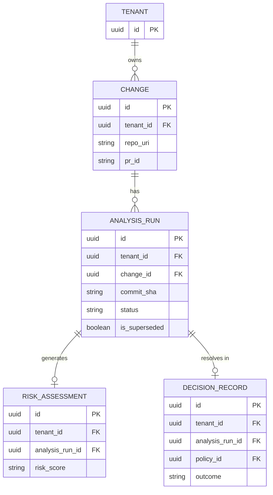
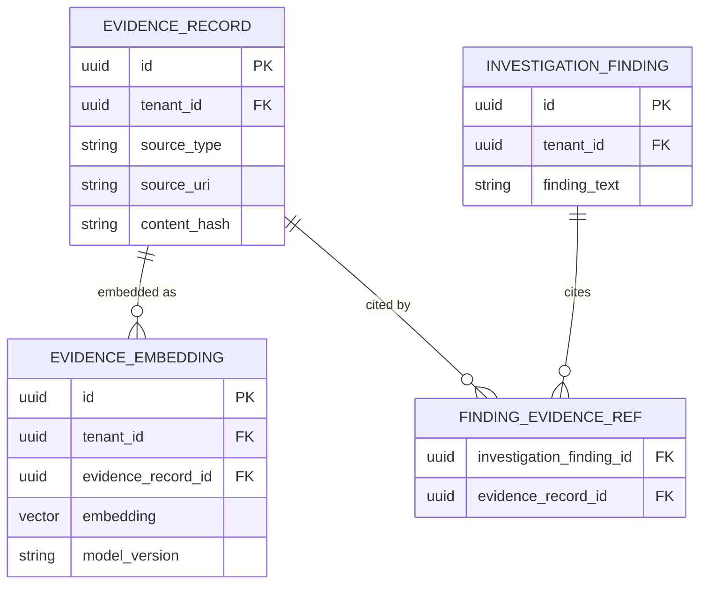

# Relational Persistence Model (V1 MVP)

This document maps the domain model to a PostgreSQL relational database design. It prioritizes strong tenant isolation, immutable historical records, and explicit distinction between current state and historical analysis runs.

## 1. Primary Key Strategy

**UUIDv7** will be used for all primary keys.
- **Why**: UUIDv7 is time-ordered. This prevents PostgreSQL index fragmentation (a common issue with UUIDv4) while retaining the benefits of distributed, offline generation without relying on database sequences.

## 2. Multi-Tenancy Strategy

**Tenant ID on every table**.
- **Why**: Adding a `tenant_id` column to every persistent record is the simplest, most robust way to ensure strong tenant isolation in a shared database schema. It simplifies query scoping, minimizes the risk of accidental cross-tenant data leaks due to missed JOINs, and perfectly prepares the schema for PostgreSQL Row-Level Security (RLS) if required later.

## 3. Persistence Boundaries and Tables

### A. Organization & System Context
*Current architectural reality.*
- `tenant`: The billing/identity unit.
- `service`: Represents a deployable unit. `id`, `tenant_id`, `name`, `criticality_tier`, `owner`. (Mutable, represents CURRENT state).
- `service_dependency`: Edge table for mapping dependencies.

### B. Change Intake & Versioning
*Distinguishing the PR from the Commit.*
- `change`: Represents the source PR/Merge Request. `id`, `tenant_id`, `repo_uri`, `pr_id`, `status`.
- `analysis_run`: Represents the explicit evaluation of a single `commit_sha`. `id`, `tenant_id`, `change_id`, `commit_sha`, `status`, `superseded`.
  - **Rationale**: A PR (`change`) receives many commits. An `analysis_run` ties the deterministic context, risk, and decision strictly to one commit snapshot.
- `changed_file`: The diff representation. `id`, `tenant_id`, `analysis_run_id`, `path`, `additions`, `deletions`.

### C. Evidence & Vector Storage
*Immutable historical truth.*
- `evidence_record`: `id`, `tenant_id`, `source_type` (e.g. INCIDENT, PR), `source_uri`, `summary`, `content_hash`, `timestamp`.
- `evidence_embedding`: Stores the `pgvector` embeddings separately. `id`, `tenant_id`, `evidence_record_id`, `chunk_index`, `embedding` (vector), `model_version`.
  - **Rationale**: Storing embeddings in a separate table allows us to re-embed the same evidence with a newer model (e.g., migrating from OpenAI `text-embedding-3-small` to `text-embedding-3-large`) without destroying the original text records.

### D. Risk & Investigation
*Objective analysis linked to a specific run.*
- `risk_assessment`: `id`, `tenant_id`, `analysis_run_id`, `risk_score`.
- `risk_factor`: `id`, `tenant_id`, `risk_assessment_id`, `description`, `signal_source`.
- `agent_investigation`: `id`, `tenant_id`, `analysis_run_id`, `status`.
- `investigation_finding`: `id`, `tenant_id`, `agent_investigation_id`, `finding_text`. (Evidence citations are stored in a cross-reference table `finding_evidence`).

### E. Policy & Decision
*Subjective enforcement.*
- `policy`: `id`, `tenant_id`, `version`, `status` (ACTIVE/ARCHIVED).
- `policy_rule`: `id`, `tenant_id`, `policy_id`, `condition`, `outcome`.
- `decision_record`: `id`, `tenant_id`, `analysis_run_id`, `policy_id`, `risk_assessment_id`, `outcome` (APPROVE/BLOCK), `reason`.
- `human_override`: `id`, `tenant_id`, `decision_record_id`, `actor_id`, `justification`.

### F. Asynchronous Job State
- `analysis_job`: `id`, `tenant_id`, `idempotency_key`, `status` (PENDING, RUNNING, COMPLETED, FAILED), `retry_count`, `locked_at`.
  - **Rationale**: Simplistic queue table for background worker execution, separate from domain state.

---

## 4. Current State vs. Historical Fact

This data model explicitly protects historical auditability:
- **Current State**: `service` and `policy` represent the *current* configuration.
- **Historical Fact**: `decision_record` links to a specific `policy_id` (which is versioned) and `analysis_run_id` (a specific commit). Even if the active policy changes, the historical decision record points to exactly the policy and commit state that existed at the time of evaluation.

---

## 5. Key Constraints & Indexes

- **Idempotency Uniqueness**: `UNIQUE (tenant_id, idempotency_key)` on `analysis_job`.
- **Analysis Uniqueness**: `UNIQUE (tenant_id, change_id, commit_sha)` on `analysis_run`.
- **Tenant FK Isolation**: All Foreign Keys must include `tenant_id` to strictly enforce tenant boundaries at the database level. E.g., `FOREIGN KEY (tenant_id, change_id) REFERENCES change (tenant_id, id)`.
- **Indexes**: 
  - GIN/IVFFlat/HNSW index on `evidence_embedding.embedding` for fast pgvector similarity search.
  - B-Tree indexes on `tenant_id`, `analysis_run_id`, and external lookup fields (`repo_uri`, `pr_id`).

---

## 6. Auditability & Common Fields

Every table contains the minimum required audit fields:
- `created_at` (Timestamp)
- `updated_at` (Timestamp)
- `correlation_id` (UUID, populated on log/job entry, optional on some entity rows, but critical on `analysis_run` and `analysis_job`).

---

## 7. Domain to Persistence Mapping

- **Aggregates**: Generally map 1:1 with tables (e.g., `DecisionRecord` -> `decision_record`).
- **Value Objects**: 
  - Embedded inside aggregate tables if 1:1 (e.g., `CommitSnapshot` is just the `commit_sha` column on `analysis_run`).
  - Stored in child tables if 1:N (e.g., `RiskFactor` becomes the `risk_factor` table, heavily foreign-keyed to its parent).
  - Only stored as JSONB if highly dynamic and never queried via SQL (e.g., raw webhook payloads).

---

## 8. Data Model Diagrams

### Core Analysis & State Diagram

### Evidence & Vector Diagram

---

## 9. Retention Considerations (Future)

- **PR Data (`analysis_run`, `changed_file`)**: High volume. May need archiving to cold storage after 1 year.
- **Evidence / Embeddings**: Retained indefinitely as historical grounding, but embeddings can be recomputed if a model is deprecated.
- **Agent Outputs**: High volume text. Might require aggressive cleanup or summarization after 90 days, retaining only the final `DecisionRecord`.

---

## 10. Open Questions

- Should `evidence_embedding` utilize HNSW or IVFFlat indexes in pgvector? (HNSW provides better recall but higher insert cost; IVFFlat is faster to build but requires regular REINDEXING).
- Does the `analysis_job` table require horizontal partitioning if webhook volume spikes dramatically?
